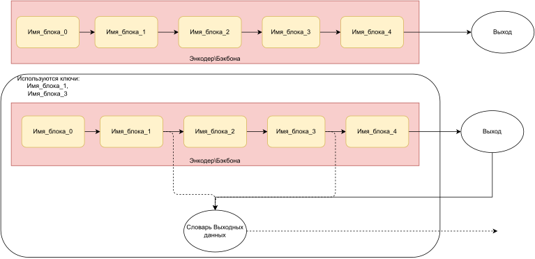

# Назначение
Декарирование форварда сети (encoder\backbone) таким образом что блоки верхнего уровня получают forward хуки, после этого, если прогнать сеть (encoder\backbone) выходы выбранных блоков верхнего уровня поместятся в словарь, как и основной выход.
Пример на схеме

